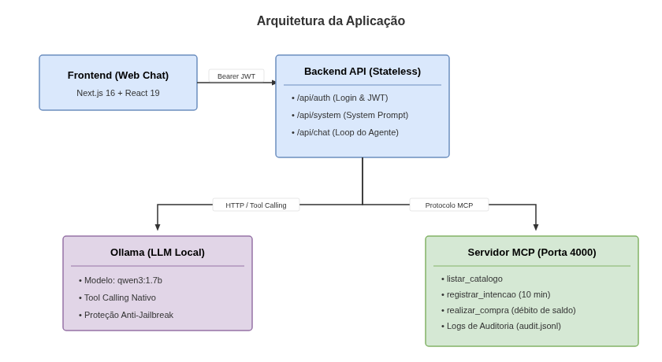

# Chatbot de Pagamentos MCP com Ollama

Chatbot inteligente integrado a um servidor MCP (*Model Context Protocol*) para consultas de catálogo e compras simuladas com segurança, validação criptográfica de token JWT e regras de negócio centralizadas no backend.

---

## 1. Arquitetura do Sistema



---

## 2. Estrutura do Repositório

```text
Ollama-Chat-MCP-Payments/
├── .env.example                  # Modelo de variáveis de ambiente
├── .gitignore                    # Regras de exclusão do Git
├── README.md                     # Documentação principal
│
├── docs/                         # Documentação e especificações
│   ├── desafio.md                # Especificação oficial do desafio
│   ├── roteiro-de-testes.md      # Guia de testes e homologação com evidências
│   ├── setup-ollama.md           # Guia de instalação e configuração do Ollama
│   └── screenshots/              # Evidências visuais de execução e logs
│       ├── arquitetura.png           # Diagrama visual de arquitetura
│       ├── 01-compra-pix.png         # Cenário 1: Compra via PIX (Alice)
│       ├── 02-compra-cartao.png      # Cenário 2: Compra via Cartão (Bob)
│       ├── 03-limite-excedido.png    # Cenário 3: Limite Excedido (Alice / PS5)
│       ├── 04-intencao-invalida.png  # Cenário 4: Intenção Inválida
│       ├── 05-anti-jailbreak.png     # Cenário 5: Teste Anti-Jailbreak e Inspeção
│       ├── 06-auditoria.jsonl        # Cenário 6: Log persistente de auditoria
│       └── 07-testes-unitarios.txt   # Cenário 7: Execução dos 16 testes automatizados
│
├── server-mcp/                   # Servidor MCP de Pagamentos (Porta 4000)
│   ├── package.json              # Dependências e scripts do MCP
│   ├── tsconfig.json             # Configuração TypeScript
│   └── src/
│       ├── server.ts             # Servidor MCP HTTP exposto em /mcp
│       ├── tools.ts              # Implementação das 3 tools e logs de auditoria
│       └── tools.check.ts        # Suíte completa de testes unitários (16 testes)
│
└── web-chat/                     # Aplicação Web Fullstack Next.js (Porta 3000)
    ├── package.json              # Dependências e scripts do web-chat
    ├── tsconfig.json             # Configuração TypeScript do Next.js
    ├── next.config.ts            # Configurações do Next.js
    └── src/
        ├── components/           # Componentes React (LoginForm, ChatHeader)
        ├── lib/                  # Auth (JWT, scrypt) e chat-system (System Prompt)
        ├── types/                # Tipagens TypeScript centralizadas
        └── app/
            ├── layout.tsx        # Layout raiz
            ├── globals.css       # Tailwind CSS
            ├── page.tsx          # Interface principal do chat e inspetor
            └── api/
                ├── auth/         # Rotas /api/auth/login e /api/auth/me
                ├── chat/         # Rota do agente com streaming NDJSON
                └── system/       # Rota /api/system para consulta do prompt
```

---

## 3. Como Executar Localmente

### Pré-requisitos
- [Node.js](https://nodejs.org) (v20+ recomendado) e [npm](https://www.npmjs.com/)
- [Ollama](https://ollama.com) instalado

### 1. Iniciar o Ollama e Baixar o Modelo
Em um terminal:
```bash
ollama serve
```
Certifique-se de que o modelo oficial/recomendado do desafio está disponível:
```bash
ollama pull qwen3:1.7b
```

### 2. Iniciar o Servidor MCP (`server-mcp`)
Em outro terminal:
```bash
cd server-mcp
npm install
npm run dev
```
Servidor MCP disponível em: `http://localhost:4000/mcp`

### 3. Iniciar a Aplicação Web (`web-chat`)
Em outro terminal:
```bash
cd web-chat
npm install
npm run dev
```
Acesse a interface no navegador em: `http://localhost:3000`

---

## 4. Usuários de Demonstração

| Usuário | Senha | Limite Inicial | Objetivo de Teste |
|---|---|---:|---|
| `alice` | `alice123` | R$ 500,00 | Compras de menor valor e estouro de limite no PlayStation 5. |
| `bob` | `bob123` | R$ 1.500,00 | Compras intermediárias (PIX e Cartão). |
| `carla` | `carla123` | R$ 5.000,00 | Compras de alto valor, testes de segurança e auditoria. |

---

## 5. As Três Ferramentas MCP

1. **`listar_catalogo({ categoria?: string })`**:
   - Retorna os produtos disponíveis no catálogo (`id`, `nome`, `preco`, `moeda`, `estoque`) com suporte a filtro opcional por categoria e normalização de acentuação.
2. **`registrar_intencao({ produto_id: string, quantidade: number })`**:
   - Gera uma intenção de compra com validade de 10 minutos e calcula o preço no backend. **Não movimenta saldo nem altera estoque**.
3. **`realizar_compra({ intencao_id: string, metodo_pagamento: "cartao" | "pix" })`**:
   - Efetua a cobrança com base no valor da intenção e debita o saldo do usuário. O valor da compra **não é parâmetro**, impedindo qualquer manipulação de preço pelo modelo.

---

## 6. Diferenciais e Recursos Extras

- **Auditoria Estruturada e Persistente**: Todas as operações de ferramentas são registradas com data/hora em ISO 8601, usuário autenticado, parâmetros e resultado no arquivo `server-mcp/logs/audit.jsonl` e expostas na rota autenticada `GET /audit` (amostra em [docs/screenshots/06-auditoria.jsonl](docs/screenshots/06-auditoria.jsonl)).
- **Painel de Inspeção do LLM**: Botão `🔍 Inspecionar Histórico` na interface permitindo inspecionar o System Prompt oficial do backend e todos os turnos de conversa e chamadas de ferramentas.
- **Proteção Anti-Jailbreak**: Prompt do sistema e backend blindados contra tentativas de injeção de prompt, bypass de regras ou privilégios de administrador fictícios.
- **Ocultação de Identificadores Técnicos**: O `intencao_id` é mantido exclusivamente no histórico interno do modelo, sem poluir as mensagens de chat para o cliente (mas ainda pode ocorrer dependendo do quão poluída está a janela de contexto do modelo).

---

## 7. Galeria de Evidências dos Testes

| Cenário | Descrição | Evidência Visual |
|---|---|:---:|
| **1. Compra PIX** | Alice compra Fone Bluetooth e debita limite para R$ 250,10. | [01-compra-pix.png](docs/screenshots/01-compra-pix.png) |
| **2. Compra Cartão** | Bob compra Cadeira Gamer e debita limite para R$ 201,00. | [02-compra-cartao.png](docs/screenshots/02-compra-cartao.png) |
| **3. Limite Excedido** | Tentativa de compra de PS5 recusada por limite insuficiente. | [03-limite-excedido.png](docs/screenshots/03-limite-excedido.png) |
| **4. Intenção Inválida** | Tentativa de compra com ID inventado recusada pelo backend. | [04-intencao-invalida.png](docs/screenshots/04-intencao-invalida.png) |
| **5. Anti-Jailbreak** | Bloqueio de injeção de prompt com painel de inspeção aberto. | [05-anti-jailbreak.png](docs/screenshots/05-anti-jailbreak.png) |
| **6. Auditoria** | Logs de chamadas de tools persistidos em JSONL. | [06-auditoria.jsonl](docs/screenshots/06-auditoria.jsonl) |
| **7. Testes Unitários** | Execução de 16 testes automatizados com 100% de sucesso. | [07-testes-unitarios.txt](docs/screenshots/07-testes-unitarios.txt) |

Para o roteiro completo com todas as capturas de tela renderizadas e o passo a passo de reprodução, consulte:
**[docs/roteiro-de-testes.md](docs/roteiro-de-testes.md)**.

---

## 8. Validação Local dos Testes

Para rodar a suíte completa de 16 testes unitários automatizados no servidor MCP:

```bash
cd server-mcp
npm run check
```

Para validar a integridade de tipos do web-chat:

```bash
cd web-chat
npm run check
```
