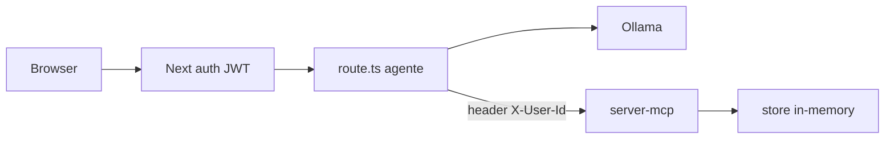
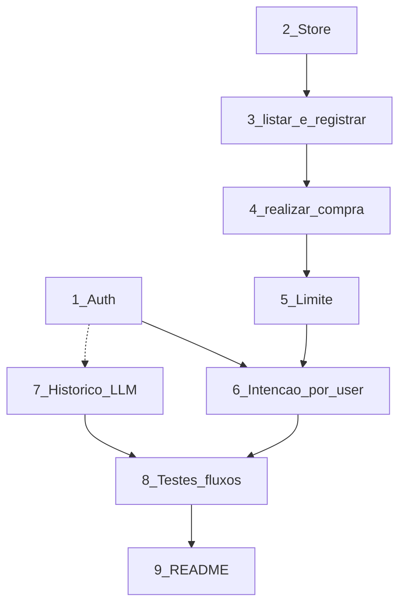

# Plano incremental: auth, MCP de pagamentos e histórico

Arquitetura preservada: `web-chat` (Next + agente + MCP client) → `server-mcp` (tools) → Ollama. Não reescrever o loop de streaming nem o transporte Streamable HTTP.

Decisões já fechadas na análise:

- Auth e JWT no Next; catálogo, intenções, saldo e transações no MCP.
- Identidade do usuário vai no header MCP (`X-User-Id`), nunca como argumento da tool (o LLM não controla isso).
- Store in-memory no processo (some no restart). Sem banco.
- Nomes das tools: `listar_catalogo`, `registrar_intencao`, `realizar_compra`.
- Remover `get_time` só quando as tools novas estiverem no agente (etapa 3+), para não misturar prompts cedo.

---

## Etapa 1 — Autenticação e usuário

Objetivo: chat inacessível sem login. Ainda sem MCP de pagamentos.

Arquivos a criar:

- [web-chat/src/lib/users.ts](web-chat/src/lib/users.ts) — 2–3 usuários seed (`id`, `username`, `password`, `limite` só informativo no Next; o saldo real virá no MCP na etapa 2). Senhas em texto no seed (workshop local).
- [web-chat/src/lib/auth.ts](web-chat/src/lib/auth.ts) — assinar/verificar JWT com `JWT_SECRET` (já em [web-chat/.env](web-chat/.env)); cookie httpOnly.
- [web-chat/src/app/api/auth/login/route.ts](web-chat/src/app/api/auth/login/route.ts) — POST `{ username, password }` → cookie + `{ id, username }`.
- [web-chat/src/app/api/auth/me/route.ts](web-chat/src/app/api/auth/me/route.ts) — GET sessão atual ou 401.
- [web-chat/src/app/api/auth/logout/route.ts](web-chat/src/app/api/auth/logout/route.ts) — limpa cookie.

Arquivos a modificar:

- [web-chat/src/app/api/chat/route.ts](web-chat/src/app/api/chat/route.ts) — 401 se JWT inválido; **não** mudar o loop LLM/MCP ainda.
- [web-chat/src/app/page.tsx](web-chat/src/app/page.tsx) — se não autenticado, formulário de login; se autenticado, o chat atual (tabs, peek, stream intactos).
- [web-chat/package.json](web-chat/package.json) — dependência `jose` (JWT).

Teste: login ok; `/api/chat` sem cookie → 401; logout some o chat.

---

## Etapa 2 — Persistência (users/produtos/intenções/transações)

Objetivo: store no MCP, ainda sem tools novas no agente. Catálogo no formato do desafio.

Arquivos a criar:

- [server-mcp/src/store.ts](server-mcp/src/store.ts) — Maps in-memory:
  - `users`: mesmo `id` dos seeds do Next + `limite` / `gasto`
  - `produtos`: `id`, `nome`, `preco`, `moeda`, `estoque`, `categoria`
  - `intencoes`: vazias no início
  - `transacoes`: vazias no início
  - helpers: `getUser`, `getProduto`, `saveIntencao`, `getIntencao`, `saveTransacao`, `debitarLimite` (podem existir e só serem usados depois)

Arquivos a modificar:

- [server-mcp/src/tools.ts](server-mcp/src/tools.ts) — `CATALOG` passa a ler o store; `listItems` adapta para o novo shape **ou** fica um wrapper temporário sobre `listarCatalogo` para não quebrar o chat atual nesta etapa.
- [server-mcp/src/tools.check.ts](server-mcp/src/tools.check.ts) — asserts do catálogo novo (ids `prod_*`, estoque, filtro categoria quando existir).

Teste: `npm run check` no `server-mcp`. Chat antigo ainda chama `list_items`.

Manter `list_items` registrado até a etapa 3 para não quebrar o UI no meio do caminho.

---

## Etapa 3 — `listar_catalogo` + `registrar_intencao`

Objetivo: registrar intenção sem mover dinheiro. `listar_catalogo` entra junto porque a intenção precisa de produto válido.

Arquivos a modificar:

- [server-mcp/src/tools.ts](server-mcp/src/tools.ts) — `listarCatalogo({ categoria? })` e `registrarIntencao({ produto_id, quantidade }, userId)`. Gera `int_…`, calcula `valor_total`, `status: "pendente"`, `expira_em` (ex. 15 min). Recusa produto inexistente / qtd ≤ 0. Ainda **sem** exigir user (userId opcional nesta etapa, ou um user seed fixo nos testes).
- [server-mcp/src/server.ts](server-mcp/src/server.ts) — registrar `listar_catalogo` e `registrar_intencao`; manter `list_items` como alias fino **ou** remover só depois do prompt (preferir alias nesta etapa).
- [server-mcp/src/tools.check.ts](server-mcp/src/tools.check.ts) — intenção ok; produto inválido.

Ainda não ligar header nem mudar o agente (exceto se quiser descobrir a tool nova automaticamente — o client já faz `listTools()`, então o modelo verá as tools novas assim que o MCP subir).

Teste: `npm run check`; no chat, “o que tem à venda” / “quero 1x prod_003” pode já chamar as tools novas se o modelo cooperar.

---

## Etapa 4 — `realizar_compra`

Objetivo: pagar a partir da intenção. Sem limite e sem dono ainda.

Contrato: args só `intencao_id` + `metodo_pagamento` (`cartao` | `pix`). Valor vem da intenção.

Arquivos a modificar:

- [server-mcp/src/tools.ts](server-mcp/src/tools.ts) — `realizarCompra`: sucesso `{ status, transacao_id, intencao_id, valor, metodo_pagamento, limite_restante, data }`; erros `INTENCAO_INVALIDA`, `INTENCAO_EXPIRADA`, `INTENCAO_JA_PAGA`, `METODO_INVALIDO`. Marcar intenção como paga; gravar transação. `limite_restante` pode ser um placeholder (ex. `user.limite - user.gasto` sem recusar) até a etapa 5.
- [server-mcp/src/server.ts](server-mcp/src/server.ts) — `registerTool('realizar_compra', …)`.
- [server-mcp/src/tools.check.ts](server-mcp/src/tools.check.ts) — pix ok, cartão ok, id inventado, expirada, já paga, método inválido.

Teste: só `npm run check`.

---

## Etapa 5 — Validação de limite

Objetivo: compra acima do saldo restante → `LIMITE_EXCEDIDO`. Backend é a barreira.

Arquivos a modificar:

- [server-mcp/src/store.ts](server-mcp/src/store.ts) / [server-mcp/src/tools.ts](server-mcp/src/tools.ts) — se `valor_total > limite - gasto` recusar **sem** debitar; senão debitar e devolver `limite_restante`.
- [server-mcp/src/tools.check.ts](server-mcp/src/tools.check.ts) — usuário seed com limite baixo vs produto caro (ex. item tipo LHC).

Ainda sem amarrar intenção a usuário: nos testes, debitar um user seed explícito.

---

## Etapa 6 — Intenção ligada ao usuário/sessão

Objetivo: o modelo não usa intenção de outro user nem id inventado. Identidade só no transporte.

Arquivos a modificar:

- [server-mcp/src/server.ts](server-mcp/src/server.ts) — ler `X-User-Id` no POST `/mcp`; passar `userId` para os handlers de `registrar_intencao` e `realizar_compra`. Sem header nessas duas → tratar como inválido / não autenticado. `listar_catalogo` pode continuar sem user.
- [server-mcp/src/tools.ts](server-mcp/src/tools.ts) — intenção grava `userId`; `realizar_compra` compara com o user do request → senão `INTENCAO_INVALIDA`.
- [web-chat/src/app/api/chat/route.ts](web-chat/src/app/api/chat/route.ts) — ao `connect()`, transport/headers com `X-User-Id` do JWT. Mínima mudança no client (não mexer no loop de rounds).
- [web-chat/src/app/page.tsx](web-chat/src/app/page.tsx) — system prompt: fluxo listar → intenção → pagar; nunca inventar `intencao_id` nem preço; explicar erro de limite em português. Remover `get_time` / `list_items` do prompt.
- [server-mcp/src/server.ts](server-mcp/src/server.ts) — remover `get_time` e o alias `list_items`.
- Corrigir default `OLLAMA_MODEL` em [web-chat/src/app/api/chat/route.ts](web-chat/src/app/api/chat/route.ts) (`qwen3:1.7b`, sem espaço).

Teste: check com dois users (intenção do A recusada no B); chat autenticado chama tools com o user da sessão.

---

## Etapa 7 — Histórico completo ao LLM

Objetivo: a cada turno o Ollama recebe mensagens **incluindo** `tool_calls` e `role: "tool"`.

O loop **dentro** de um POST em [web-chat/src/app/api/chat/route.ts](web-chat/src/app/api/chat/route.ts) já empilha isso. O buraco é o frontend.

Arquivos a modificar:

- [web-chat/src/app/page.tsx](web-chat/src/app/page.tsx):
  - Tipo de mensagem alinhado ao backend (`tool_calls`, `role: "tool"`).
  - Acumular no estado as tool calls/resultados daquele turno (os eventos `{ tool }` do NDJSON).
  - Payload = `[SYSTEM, ...histórico rico, user]`.
  - Remover o modo “Sem memória”; um único chat com histórico.

Não alterar o encoder NDJSON nem o `MAX_ROUNDS`.

Teste: segundo turno (“paga no pix”) ainda vê o `intencao_id` no peek/payload.

---

## Etapa 8 — Testes dos fluxos obrigatórios

Objetivo: cobrir os critérios de conclusão sem depender do LLM.

Arquivos a modificar/criar:

- [server-mcp/src/tools.check.ts](server-mcp/src/tools.check.ts) (ou `src/flows.check.ts`) — script único, determinístico:
  1. catálogo
  2. intenção + compra `pix`
  3. intenção + compra `cartao`
  4. limite excedido
  5. `intencao_id` inventado
  6. intenção de outro usuário
  7. intenção expirada / já paga

- [server-mcp/package.json](server-mcp/package.json) — `check` roda esse script + `tsc`.

Teste manual curto no browser (evidências): login, compra, limite, id falso — screenshots depois, fora deste plano de código.

---

## Etapa 9 — README

Arquivos a modificar:

- [README.md](README.md) — o que existe de fato: três processos (Ollama, MCP, Next), users seed e senhas, modelo `qwen3:1.7b`, fluxo das 3 tools, nota de store in-memory, `npm run check`. Remover menção a pastas/auth que não existiam; documentar as que esta implementação criar.
- [.env.example](.env.example) — só se alguma var nova aparecer (provavelmente nenhuma).

Não inventar componentes que o código não tem.

---

## Fora de escopo (a menos que sobre tempo)

- Log auditável de tools, SQLite, NextAuth, modo stateless, testes E2E do Ollama.

---

## Dependências entre etapas

- **1** não bloqueia 2–5 (MCP testa sem JWT).
- **6** precisa de **1** (JWT → header) e de **5** (compra completa).
- **7** só depende do frontend/agente; pode em paralelo com 2–5, mas só é “fluxo feliz” no chat depois de **6**.
- **8** consolida 2–7.
- **9** por último, com o que realmente rodou.
